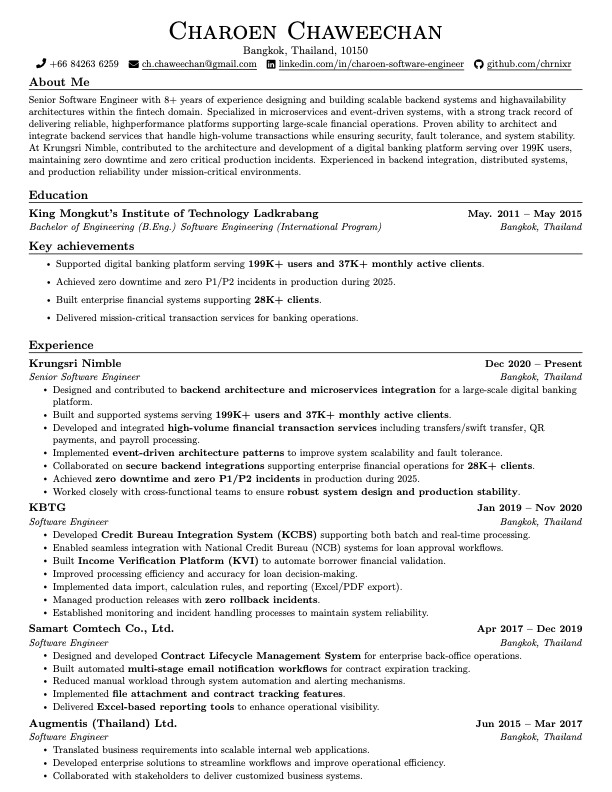

# Charoen Chaweechan - Software Engineer Resume

A professional resume template built with LaTeX for software engineers.

## 📋 About

This is my personal resume showcasing 8+ years of experience in:
- **Backend Systems & Microservices** - Designing scalable architectures
- **Fintech Domain** - Building secure, high-availability financial platforms
- **Event-Driven Systems** - Implementing fault-tolerant distributed systems
- **Production Reliability** - Maintaining zero downtime in mission-critical environments

## 🏆 Key Highlights

- ✅ Senior Software Engineer at Krungsri Nimble (Dec 2020 - Present)
- ✅ Supported digital banking platform serving **199K+ users**
- ✅ Achieved **zero downtime and zero P1/P2 incidents** in production (2025)
- ✅ Built enterprise financial systems supporting **28K+ clients**
- ✅ 8+ years of experience in backend engineering and fintech

## 📚 Skills

**Languages:** Python, Java, C#, TypeScript/JavaScript, HTML, CSS, SQL

**Cloud & Infrastructure:** AWS, Azure, CI/CD

**Technologies:** .Net Core, .Net Framework, Spring Boot, Docker, MS SQL, PostgreSQL, Git, Dynatrace, GitHub Copilot, Claude Code

## 📥 Download Resume

[📄 Download Resume PDF](./charoen_cv.pdf)

---
## 🚀 Quick Start

### Option 1: Build with Docker (Recommended)

```bash
# Make build script executable
chmod +x build.sh

# Run build script
./build.sh
```

This will:
1. Build a Docker image with LaTeX tools
2. Compile `charoen_resume.tex` to `charoen_resume.pdf`

### Option 2: Build Manually (if LaTeX installed)

```bash
pdflatex charoen_resume.tex
```

### Option 3: Online Editor

Use [Overleaf](https://www.overleaf.com/) - upload `charoen_resume.tex` and compile online

## 📁 Project Structure

```
.
├── charoen_resume.tex       # Main resume source (LaTeX)
├── Dockerfile               # Docker image for LaTeX compilation
├── build.sh                 # Build script to generate PDF
├── README.md                # This file
└── .gitignore               # Git ignore rules for LaTeX artifacts
```

## 📝 How to Edit

1. **Edit the LaTeX file:** Open `charoen_resume.tex` in your favorite text editor
2. **Make changes** to sections, experience, skills, etc.
3. **Generate PDF:**
   ```bash
   ./build.sh
   ```
4. **Commit changes:**
   ```bash
   git add .
   git commit -m "Update resume"
   git push
   ```

## 🐳 Docker Details

The `Dockerfile` uses Alpine Linux with:
- `texlive` - Core LaTeX distribution
- `texlive-luatex` - Advanced LaTeX engine
- `texmf-dist-latexextra` - Extra packages
- `texmf-dist-fontsrecommended` - Recommended fonts
- `fontawesome` - Icon fonts (for FontAwesome icons)

## 📄 Output

After building, you'll get:
- `charoen_resume.pdf` - Compiled resume PDF

## 📖 LaTeX Template Features

✅ **ATS-Friendly** - Machine readable and parsable by Applicant Tracking Systems
✅ **Professional Design** - Clean, one-column layout
✅ **Custom Commands** - Easy to format sections and items
✅ **FontAwesome Icons** - Professional icons for contact info
✅ **Optimized Margins** - Maximum content in one page
✅ **MIT License** - Feel free to use and modify

## 📄 License

MIT License - See LICENSE file for details

## 👨‍💻 Author

**Charoen Chaweechan**
- 📧 Email: ch.chaweechan@gmail.com
- 💼 LinkedIn: [charoen-software-engineer](https://linkedin.com/in/charoen-software-engineer/)
- 🐙 GitHub: [@chrnixr](https://github.com/chrnixr)
- 📱 Phone: +66 84263 6259

---

**Last Updated:** 2026
